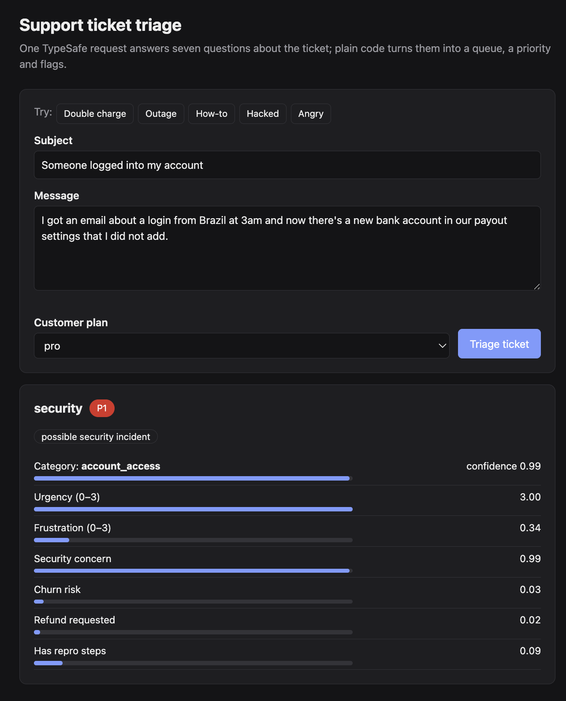

# Support ticket triage demo

Routes incoming support tickets to the right queue, sets a priority, and flags
security incidents, churn risk and refund requests, using
[TypeSafe](https://docs.typesafe.ai) typed AI judgments plus plain TypeScript rules.



## How it works

1. **One API call per ticket.** All seven questions go to TypeSafe in a single request and are evaluated in parallel
   (`src/triage.ts` → `QUESTIONS`):

   | Question | Type | Used for |
   | --- | --- | --- |
   | `category` | Choice | Which team: billing, technical, account, how-to, feature request, other |
   | `urgency` | Score 0–3 | Base priority |
   | `frustration` | Score 0–3 | Priority bump |
   | `security_concern` | Noul | Overrides everything → security queue, P1 |
   | `churn_risk` | Noul | Priority bump, notify account manager |
   | `refund_requested` | Noul | Billing flag (ignored for other categories) |
   | `has_repro_steps` | Noul | Engineering flag (ignored for other categories) |

2. **Code owns the policy.** `decide()` is a pure function that combines the answers with facts we already know
   (the customer's plan). Thresholds live in `POLICY`.
3. **Uncertainty is handled explicitly.** When the model isn't confident about the category, the ticket goes to
   `human_triage` with a reason instead of being guessed.

## Run it

Requires Node 20+ and a TypeSafe API key.

```sh
npm install
cp .env.example .env        # then put your key in .env
npm test                    # offline tests of the routing policy, no key needed
npm run triage              # triage the sample tickets in src/sample-tickets.ts
npm run serve               # web demo at http://localhost:3000
```

## Before using this for real

- Label 100–200 of your real tickets and measure accuracy; tune `POLICY` thresholds on that data.
- Jev is trained mainly on English; accuracy on Dutch or other languages is lower.
- Check TypeSafe's pricing and data-processing terms (GDPR) before sending customer data.
